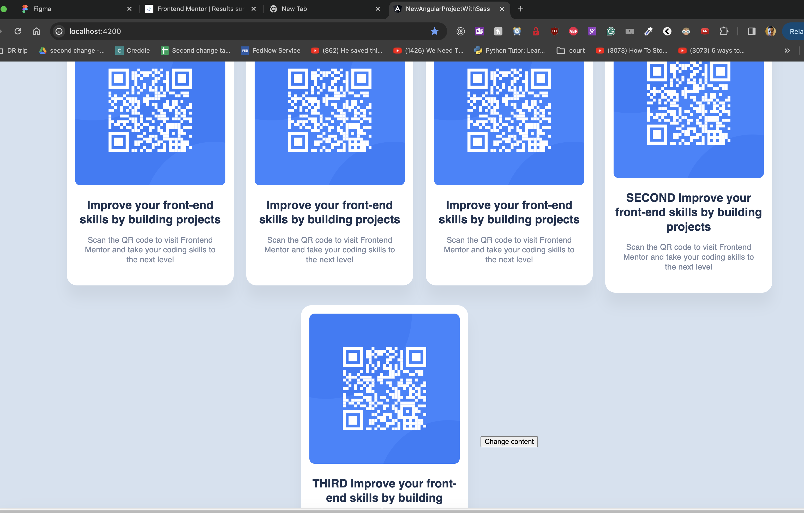

# Lessons Learn

# How to best handle multiple shared config files for shared components?

You can have each item be its own object so its easier to edit it. 
When you have a list of does config then use a getter array.
> elimantes the need to loop around
Have a array handle the config, and later on you can ngfor it resulting in more Dry code.

```ts
import { Component } from '@angular/core';
import { QrCodeComponent } from './qr-code/qr-code.component';
import { QrCardComponent } from '../../shared/components/card/qr-card.component';
import { ICardConfig } from '../../core/interfaces/card-config.interface';
import { NgForOf } from '@angular/common';

@Component({
  selector: 'app-qr-cards',
  templateUrl: './qr-cards.component.html',
  styleUrls: ['./qr-cards.component.scss'],
  standalone: true,
  imports: [QrCodeComponent, QrCardComponent, NgForOf],
})
export class QrCardsComponent {
  cardConfig: ICardConfig = {
    title: 'Improve your front-end skills by building projects',
    message:
      'Scan the QR code to visit Frontend Mentor and take your coding skills to the next level',
  };
  secondCard: ICardConfig = {
    title: 'SECOND Improve your front-end skills by building projects',
    message:
      'Scan the QR code to visit Frontend Mentor and take your coding skills to the next level',
  };
  thirdCard: ICardConfig = {
    title: 'THIRD Improve your front-end skills by building projects',
    message:
      'Scan the QR code to visit Frontend Mentor and take your coding skills to the next level',
  };
  cards = [this.cardConfig, this.secondCard, this.thirdCard];

  /**
   * Getter solve the issue of having to remember to update the array when changing the whole array
   */
  get getterCards() {
    return [this.cardConfig, this.secondCard, this.thirdCard];
  }

  changeOrder(event: Event) {
    event.preventDefault();
    this.cards = [this.secondCard, this.thirdCard, this.cardConfig];
  }

  changeByPartsContent(event: Event) {
    event.preventDefault();
    this.secondCard.message = 'Second Message Has Change';
    this.secondCard.title = 'Second Message Has Change';

    this.secondCard = {
      message: 'Second Message Has Change',
      title: 'Second Message Has Change',
    };
  }

  /**
   * You can but the whole array needs to be updated
   * @param event
   */
  changeWholeContent(event: Event) {
    event.preventDefault();
    this.secondCard = {
      message: 'Whole object change',
      title: 'Whole object change',
    };
  }
}

```
```html
<article class="cards">
  <app-qr-code></app-qr-code>
  <app-card [cardConfig]="cardConfig"></app-card>
  <app-card *ngFor="let config of this.cards" [cardConfig]="config"></app-card>
  <button (click)="changeOrder($event)">Change content</button>
</article>
```

### Moving the order of the qr-cards when clicking on the button

#### Before


#### After


## Adding routing

### Router-outlet selector tag in the app html

```html
<router-outlet></router-outlet>
```

### Routing file

#### App routing file

```ts
import {NgModule} from '@angular/core';
import {RouterModule, Routes} from '@angular/router';

const rootPath = {
  qrCode: 'qr-code' as 'qr-code',
  home: '' as '',
}
const routes: Routes = [
  {
    path: rootPath.qrCode,
    loadChildren: () => import("./modules/qr-code/qr-code-routing.module").then((m) => m.QrCodeRoutingModule)
  },
  {
    path: rootPath.home,
    loadChildren: () => import("./modules/qr-code/qr-code-routing.module").then((m) => m.QrCodeRoutingModule)
  },
];

@NgModule({
  imports: [RouterModule.forRoot(routes)],
  exports: [RouterModule]
})
export class AppRoutingModule {
}

```

#### Nesting routing files
> Note that nesting children routes need to use the forChild instead of forRoot
> Only the app routing gets to use the forRoot
```ts
import {NgModule} from '@angular/core';
import {RouterModule, Routes} from "@angular/router";
import {QrCodeComponent} from "./qr-code.component";

const qrCodePath = {
  qrCode: "qr-code" as "qr-code",
  home: '' as '',
}
const routes: Routes = [
  {
    path: qrCodePath.qrCode,
    component: QrCodeComponent
  },
  {
    path: qrCodePath.home,
    component: QrCodeComponent
  },
]

@NgModule({
  imports: [
    RouterModule.forChild(routes)
  ],
  exports: [RouterModule]
})
export class QrCodeRoutingModule {
}

```

## Having the SCSS import path to be just the name file?
We need to add where the files are on the angular.json folder. We do this through the stylePreprocessorOptions and includePaths string array inside the architect > build. It can be added next to the styles array string.

### Key import
```json
"stylePreprocessorOptions": {
              "includePaths": [
                "src/styles"
              ]
            },
```

### zoom out view
```json
"architect": {
"build": {
"builder": "@angular-devkit/build-angular:browser",
"options": {
"outputPath": "dist/new-angular-project-with-sass",
"index": "src/index.html",
"main": "src/main.ts",
"polyfills": [
"zone.js"
],
"tsConfig": "tsconfig.app.json",
"inlineStyleLanguage": "scss",
"assets": [
"src/favicon.ico",
"src/assets"
],
"styles": [
"src/styles.scss"
],
"stylePreprocessorOptions": {
"includePaths": [
"src/styles"
]
},
"scripts": []
},
...
}
```
